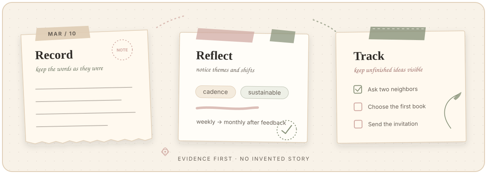

<p align="center">
  
</p>

<p align="center">
  <strong>English</strong> · <a href="README.zh-CN.md">简体中文</a> · <a href="CHANGELOG.md">Changelog</a>
</p>

<p align="center">
  <a href="https://github.com/konsyuukun-maker/reflective-journal-review/actions/workflows/validate.yml"></a>
  <a href="LICENSE"></a>
  
  
</p>

<p align="center">
  
</p>

# Turn journal entries into grounded reflection.

An open-source, cross-agent Skill that turns journal entries into evidence-grounded daily and seven-day reviews—surfacing recurring themes, shifts in thinking, and unfinished ideas without inventing a story. It follows the [Agent Skills open specification](https://agentskills.io/specification).

Built for people who already write journals, keep Markdown notes, or practice reflective journaling and want a clearer way to observe what changes over time. The Skill works with supplied text, selected files, or an optionally configured local journal directory.

## Install

Install with the open [Skills CLI](https://github.com/vercel-labs/skills). Without an `--agent` option, the CLI detects installed agents and lets you choose a target:

```bash
npx skills add konsyuukun-maker/reflective-journal-review --skill reflective-journal-review
```

Then ask your agent: `Use the reflective-journal-review skill to review my journal for 2026-03-14.` Codex users can also invoke it explicitly as `$reflective-journal-review`.

To install the same Skill into all six CI-verified targets:

```bash
npx skills add konsyuukun-maker/reflective-journal-review --skill reflective-journal-review -a codex -a claude-code -a cursor -a gemini-cli -a github-copilot -a opencode
```

Add `--global` to make the Skill available across projects for the selected agents.

## Agent compatibility

One canonical Skill directory is shared across every target. The repository does not maintain agent-specific copies of the review logic.

| Agent | Skills CLI ID | Verified scope |
| --- | --- | --- |
| Codex | `codex` | Discovery, installation, packaged resources, and safe saving |
| Claude Code | `claude-code` | Discovery, installation, packaged resources, and safe saving |
| Cursor | `cursor` | Discovery, installation, packaged resources, and safe saving |
| Gemini CLI | `gemini-cli` | Discovery, installation, packaged resources, and safe saving |
| GitHub Copilot | `github-copilot` | Discovery, installation, packaged resources, and safe saving |
| OpenCode | `opencode` | Discovery, installation, packaged resources, and safe saving |

These checks validate the open Skill package and deterministic save behavior; they do not launch, benchmark, or claim end-to-end testing against each vendor's paid model service. Other targets supported by the Skills CLI can install the same standards-based folder, but are community-compatible rather than CI-verified here.

<details>
<summary><strong>Manual installation</strong></summary>

Clone the repository and copy the canonical Skill directory into the skills directory recognized by your agent:

```bash
git clone https://github.com/konsyuukun-maker/reflective-journal-review.git
cp -R reflective-journal-review/skills/reflective-journal-review /path/to/your-agent/skills/
```

Prefer the CLI when possible because it selects the correct project or global path for each supported agent.

</details>

## What it helps you notice

| Notice | What the review looks for |
| --- | --- |
| **Recurring themes** | Topics, concerns, people, or questions that return across entries. |
| **Shifts in thinking** | Changes in assumptions, priorities, interpretations, or preferred next steps. |
| **Unfinished ideas** | Intentions and follow-ups that appear in the record without evidence of completion. |

The goal is not to manufacture a neat life story. It is to make the structure already present in your own words easier to see.

## See it in action

The repository includes a synthetic reading-circle journal so you can inspect the full flow without exposing anyone's private writing.

**1 · Record**

> **2026-03-10:** I want to start a neighborhood reading circle. I wrote down three possible formats but have not contacted anyone yet.

**2 · Reflect on one day**

> Two neighbor conversations moved the idea from private planning to early validation. Their preference for a monthly meeting challenged the writer's initial assumption that weekly meetings would maintain momentum.

**3 · Observe the seven-day thread**

> The idea progressed from outlining formats to testing interest and drafting an invitation. The plan became smaller and more sustainable, while choosing the first book and sending the invitation remained unfinished.

Explore the complete fictional artifacts: [source journal](examples/sample-journal.md), [daily review](examples/sample-daily-review.md), and [seven-day review](examples/sample-weekly-review.md).

## Two review modes

| Mode | Review window | Best for |
| --- | --- | --- |
| `daily-review` | One specified calendar date | Understanding the day's main themes, insights, new ideas, shifts, and open follow-ups. |
| `weekly-review` | An inclusive end date plus the previous six calendar days | Seeing cross-day patterns, important turns, progress, and ideas that still lack completion evidence. |

Missing dates are skipped rather than treated as proof that nothing happened. Daily summary files are not used as weekly input by default, which keeps the analysis grounded in the original entries.

## Grounded by evidence

Every review keeps four levels distinct:

1. **Recorded fact or event** — what the source directly says happened.
2. **The writer's own view** — a stated feeling, judgment, preference, or interpretation.
3. **Cautious observation** — an analytical inference clearly presented as an observation or possibility.
4. **Optional suggestion** — included only when requested or clearly appropriate.

The Skill does not invent motives, emotions, diagnoses, or task status. An idea remains unfinished until the record contains evidence that it was completed. Empty sections are omitted instead of being filled with speculation.

## Quick start

Daily review:

```text
Use the reflective-journal-review skill to review my journal for 2026-03-14.
Separate what I recorded from cautious observations, and do not invent missing context.
```

Seven-day review:

```text
Use the reflective-journal-review skill to create a seven-day review ending 2026-03-15
from the files I attached. Track unfinished ideas and include their first observed dates.
```

If the request does not establish a mode or provide an accessible source, the Skill asks rather than silently choosing or pretending to have read material.

## Input and saving

Input is resolved in this order:

1. Text or files explicitly supplied by the user.
2. A `journal_root` configured in local agent instructions.
3. A request for the missing journal source when neither is available.

Explicit input is not combined with an automatically discovered directory unless the user requests both. To configure local discovery, adapt [`examples/AGENTS.example.md`](examples/AGENTS.example.md) with your own paths.

Reviews return as Markdown in the conversation by default. Files are created only when the user asks or local instructions define an output directory:

- Daily: `YYYY-MM-DD-SUM.md`
- Seven-day: `YYYY-MM-DD～MM-DD-7dSUM.md`

Saving requires Python 3.11 or newer. The included cross-platform script is create-only and rejects existing destinations, symlinks, invalid dates, empty sources, and weekly ranges other than seven calendar days:

```bash
# macOS or Linux
python3 skills/reflective-journal-review/scripts/save_review.py daily OUTPUT_DIR YYYY-MM-DD SOURCE_FILE

# Windows
py -3 skills/reflective-journal-review/scripts/save_review.py daily OUTPUT_DIR YYYY-MM-DD SOURCE_FILE
```

The previous `bash .../save_review.sh` interface remains available on macOS and Linux and delegates to the same Python implementation. If a compatible Python runtime is unavailable, return the review in the conversation instead of bypassing the create-only protection.

## Development

Run the repository checks:

```bash
python3 tests/validate_structure.py
python3 tests/test_save_review.py
bash tests/test_save_review.sh
```

Before a release, also run the Agent Skills reference validator and OpenAI Skill Creator's `quick_validate.py` against `skills/reflective-journal-review`. Contributions should preserve the evidence boundaries and use fictional material only; see [CONTRIBUTING.md](CONTRIBUTING.md).

## License

MIT

> If this helps you see your own patterns more clearly, star the repository so you can find it again.
